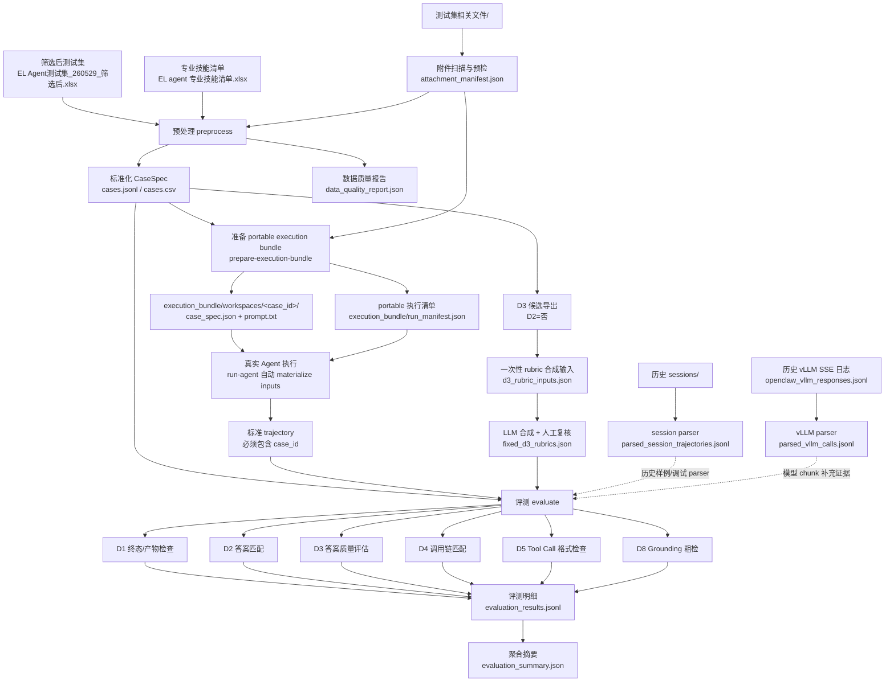

# EL Agent 评测 Pipeline

本项目包含一套轻量级本地 pipeline，用于处理筛选后的 EL Agent 测试集、测试附件、历史 session / vLLM 日志，以及后续自动化评测结果。

## 快速开始

运行完整本地 pipeline：

```bash
PYTHONPATH=src python3 -m el_eval_pipeline.cli run-all --output-dir outputs/pipeline
```

运行测试：

```bash
PYTHONPATH=src python3 -m pytest -q
```

## 输入文件

- `EL Agent测试集_260529_筛选后.xlsx`：筛选后的正式测试集入口。
- `测试集相关文件/`：测试集中所有文件型输入的附件根目录。
- `EL agent 专业技能清单.xlsx`：垂域专业 skill registry。
- `sessions/`：历史 OpenClaw session 日志，用于验证和调试 session parser。
- `openclaw_vllm_responses.jsonl`：历史 vLLM SSE 日志，用于验证和调试 vLLM chunk parser。

附件 manifest 会自动忽略 `~$*` 和 `.DS_Store` 这类临时文件。

## 处理逻辑图



图中虚线表示当前只作为历史日志解析样例或补充证据，不作为筛选后测试集的正式一一对应来源。正式评分需要真实 Agent 执行后产出带 `case_id` 的标准 trajectory。

## 处理步骤详解

### 1. 预处理筛选后测试集

输入形式：

- 文件：`EL Agent测试集_260529_筛选后.xlsx`
- 表结构：第 1 行是 D1/D4/D2 分组表头，第 2 行是实际字段名，第 3 行开始是 case。
- 关键字段：`输入（文本）`、`输入（图片/文件）`、`参考答案`、`文件状态`、`Skill`、`Tool`、`是否可明确匹配的`、`若是，答案是什么`。

处理逻辑：

- 跳过第 1 行分组表头，用第 2 行作为字段名。
- 删除全空行。
- 为每条 case 生成稳定 `case_id`，格式为 `EL260529F-0001...`。
- 保留 `source_file`、`source_sheet`、`source_row`，便于回查原始 Excel。
- 将 D1 的 `文件状态` 转成 `target_state.required_files[]`。
- 将 D4 的 `Skill` / `Tool` 转成 `gold_chain.stages[]`。
- 将 D2 的标准答案转成 `expected_answer.assertions[]`；可解析数值时转为 `numeric_contains`，否则转为 `text_contains`。
- 对 D2=是但缺少答案的 case 标记 `d2_expected_answer_missing`。
- 对 `是否可明确匹配的` 标注为 `否` 的 case 标记 `d3_candidate=true`，后续进入 D3 答案质量评估。

输出形式：

- `outputs/pipeline/cases.jsonl`：完整标准化 `CaseSpec`，一行一个 case。
- `outputs/pipeline/cases.csv`：便于人工检查的简化表。
- `outputs/pipeline/data_quality_report.json`：数据质量与覆盖率报告。

### 2. 扫描与预检附件

输入形式：

- 目录：`测试集相关文件/`
- 文件类型：`.pdf`、`.pptx`、`.docx`、`.xlsx`、`.csv`
- 测试集引用方式：Excel 的 `输入（图片/文件）` 单元格中填写文件名；多文件用空行或换行分隔。

处理逻辑：

- 递归扫描 `测试集相关文件/`。
- 忽略 `~$*` 和 `.DS_Store`。
- 计算每个附件的 `sha256`、文件大小、扩展名、MIME 类型。
- 对附件做轻量可读性预检：
  - CSV：尝试编码识别，统计行数、最大列数、表头样例。
  - XLSX：读取 sheet 名、行数、列数。
  - PDF：优先读取页数；如果缺少 PDF 解析库，则退化为文件头检查。
  - DOCX：优先读取段落数和表格数；否则退化为 zip 结构检查。
  - PPTX：通过 zip 结构统计 slide 数。
- 按 basename 将 case 中的附件引用解析到唯一文件。
- 找不到或匹配到多个候选时，记录 `attachment_resolution_error`。

输出形式：

- `outputs/pipeline/attachment_manifest.json`：唯一有效附件清单。
- `cases.jsonl` 中每条 case 的 `attachments[]`：包含 `original_path`、`relative_path`、`mime_type`、`sha256`、`preflight`。
- `data_quality_report.json` 中的 `attachment_errors[]`。

### 3. 加载 skill registry

输入形式：

- 垂域 skill：`EL agent 专业技能清单.xlsx`
- runtime skill：`sessions/sessions.json`

处理逻辑：

- 从专业技能清单中读取垂域 skill 名、用途、触发场景、典型输出。
- 从 `sessions/sessions.json` 中读取历史运行环境里出现过的 runtime skill。
- 合并两类 registry，用于检查测试集中标注的 `关于skill` 是否可识别。
- 未出现在任一 registry 中的 skill 会进入 `unknown_skills`。

输出形式：

- 不单独写 registry 文件。
- `data_quality_report.json` 中输出 `unknown_skills`、`unknown_skill_count`、`skill_counts`。

### 4. 准备每条 case 的 workspace

输入形式：

- `outputs/pipeline/cases.jsonl`
- `outputs/pipeline/attachment_manifest.json`
- 原始附件文件

处理逻辑：

- 为每条 case 创建独立目录：`outputs/pipeline/workspaces/<case_id>/`。
- 将该 case 引用的附件复制到 `inputs/` 子目录。
- 生成 `prompt.txt`：
  - 第一部分是 `user_query`。
  - 如果有附件，追加附件相对路径列表。
- 生成该 case 的 `case_spec.json`，其中附件会补充 `sandbox_path`、`sandbox_relative_path`、`sandbox_sha256`。
- 生成 `run_manifest.json`，记录每条 case 的 `run_id`、workspace、prompt 路径和执行状态。

输出形式：

- `outputs/pipeline/workspaces/<case_id>/prompt.txt`
- `outputs/pipeline/workspaces/<case_id>/case_spec.json`
- `outputs/pipeline/workspaces/<case_id>/inputs/*`
- `outputs/pipeline/prepared_cases.jsonl`
- `outputs/pipeline/run_manifest.json`

### 5. 真实 Agent 执行

输入形式：

- 每条 case 的 portable workspace。
- `prompt.txt`。
- repo 中的原始附件目录 `测试集相关文件/`。
- `run_manifest.json` 中的 `case_id` / `run_id`。
- 一条开发同事提供的 EL Agent / OpenClaw 启动命令。

处理逻辑：

- `run-agent` 会逐条读取 `execution_bundle/run_manifest.json`。
- bundle 中默认不提交重复附件副本，因此每条 case 执行前，runner 会根据 `case_spec.json` 中的 `original_relative_path` 自动把附件复制到当前 workspace 的 `inputs/`。
- runner 会生成运行时 `runtime_case_spec.json`，其中包含 materialized 后的 `sandbox_path`、`sandbox_relative_path` 和 sha256；外部命令拿到的 `EL_EVAL_CASE_SPEC` 指向这个运行时文件。
- 每条 case 在自己的 workspace 下执行，命令的工作目录就是 `execution_bundle/workspaces/<case_id>/`。
- runner 会通过环境变量把执行上下文传给外部命令：
  - `EL_EVAL_CASE_ID`
  - `EL_EVAL_RUN_ID`
  - `EL_EVAL_WORKSPACE`
  - `EL_EVAL_PROMPT_PATH`
  - `EL_EVAL_CASE_SPEC`
  - `EL_EVAL_AGENT_OUTPUT`
  - `EL_EVAL_ATTACHMENTS_JSON`
- 外部命令应读取 `EL_EVAL_PROMPT_PATH` 和 `EL_EVAL_CASE_SPEC`，调用 EL Agent / OpenClaw，并把结果写入 `EL_EVAL_AGENT_OUTPUT` 指向的 JSON 文件。
- `EL_EVAL_AGENT_OUTPUT` 建议包含 `final_response`、`session_id`、`turn_id`、`steps[]`、`tool_calls[]`、`tool_results[]`、`model_calls[]`。
- 如果外部命令没有写完整 trajectory，runner 也会根据 `agent_output.json`、stdout/stderr 和 workspace 文件清单生成兜底 trajectory。
- runner 会扫描执行前后的 workspace 文件，写入 `sandbox_initial_files[]` 和 `sandbox_final_files[]`；D1 可以基于这个文件清单检查产物，不强制要求开发同事打包完整 workspace。

输出形式：

- 标准 trajectory JSONL，建议一行一个 case。
- 每条 trajectory 必须包含：
  - `case_id`
  - `run_id`
  - `session_id`
  - `turn_id`
  - `user_query`
  - `final_response`
  - `steps[]`
  - `tool_calls[]`
  - `tool_results[]`
  - `attachments[]`
  - `sandbox_initial_snapshot_ref`
  - `sandbox_final_snapshot_ref`
  - `sandbox_initial_files[]`
  - `sandbox_final_files[]`
  - `sandbox_intercept_log[]`

示例命令：

```bash
PYTHONPATH=src python3 -m el_eval_pipeline.cli run-agent \
  --manifest execution_bundle/run_manifest.json \
  --output outputs/pipeline/trajectories.jsonl \
  --command 'python /path/to/openclaw_runner.py --case-spec "$EL_EVAL_CASE_SPEC" --prompt "$EL_EVAL_PROMPT_PATH" --output "$EL_EVAL_AGENT_OUTPUT"'
```

外部 OpenClaw runner 的输出 JSON 最小格式：

```json
{
  "final_response": "...Agent 最终回答...",
  "session_id": "...",
  "turn_id": "...",
  "steps": [],
  "tool_calls": [],
  "tool_results": []
}
```

### 6. 解析历史 session 日志

输入形式：

- 目录：`sessions/`
- 文件：`.jsonl` 与 `.jsonl.reset.*`
- 日志记录类型：`session`、`message`
- message role：`user`、`assistant`、`toolResult`

处理逻辑：

- 按 user message 切分 turn。
- 聚合同一 turn 后续的 assistant 文本、toolCall、toolResult。
- 用 `toolCallId` 将 tool call 与 tool result 对齐。
- 提取 `responseId`、model、provider、usage 等模型调用元信息。
- 如果 assistant 文本中泄漏 `</think>`，只把 `</think>` 后的内容作为 `final_response`。

输出形式：

- `outputs/pipeline/parsed_session_trajectories.jsonl`
- 注意：这是历史日志解析样例，不自动视为筛选后测试集的正式 trajectory。

### 7. 解析历史 vLLM SSE 日志

输入形式：

- 文件：`openclaw_vllm_responses.jsonl`
- 每行包含 `req_id`、`ts`、`chunk_text`
- `chunk_text` 是 SSE 格式，如 `data: {...}` 或 `data: [DONE]`

处理逻辑：

- 按 `req_id` 分组。
- 拼接 assistant content chunk。
- 重建分片输出的 `tool_calls[].function.name` 和 `tool_calls[].function.arguments`。
- 记录 `finish_reason`，如 `tool_calls` / `stop`。
- 提取 `chatcmpl-*` response id。

输出形式：

- `outputs/pipeline/parsed_vllm_calls.jsonl`
- 注意：该文件只重建模型层调用，不包含完整 tool result，因此不能单独作为正式 trajectory。

### 8. 自动评测

输入形式：

- `outputs/pipeline/cases.jsonl`
- 标准 trajectory JSONL；如果没有真实 trajectory，则各维度会明确输出 blocked。
- 可选：固定后的 D3 rubrics JSON/JSONL。
- 可选：OpenAI-compatible Judge 配置，来自命令行参数或 `D3_JUDGE_BASE_URL`、`D3_JUDGE_API_KEY`、`D3_JUDGE_MODEL` 环境变量。

处理逻辑：

- 按 `case_id` 将 CaseSpec 与 trajectory 对齐。
- D1：读取 `target_state.required_files[]`，在 workspace 或 sandbox final snapshot 下检查目标产物是否存在。
- D2：读取 `expected_answer.assertions[]`，在 `final_response` 中做数值或文本匹配。
- D3：仅对 `d3_candidate=true` 的 case 运行。先用固定 rubrics 拆成逐条 rubric 判断，再按权重汇总；core rubric 失败会阻断通过，默认通过阈值为 `0.75`。
- D4：读取 `gold_chain.stages[]`，检查 trajectory 中是否覆盖 required skill/tool。
- D5：检查 `tool_calls[]` 的工具名和参数 JSON 是否可解析。
- D8：从 `final_response` 抽取粗粒度数值/实体，再到 `tool_results[]` 证据文本中做 grounding 命中检查。
- 若 D8 已经有分数且低于 `0.5`，D3 会先判为 `grounding_fail_precheck`，避免无证据答案靠文字质量过关。
- 对缺少必要输入的维度输出 `blocked`，对不适用维度输出 `not_applicable`。

输出形式：

- `outputs/pipeline/evaluation_results.jsonl`：case 级评测明细。
- `outputs/pipeline/evaluation_summary.json`：维度级聚合摘要。

### 9. D3 rubric 一次性准备

输入形式：

- `outputs/pipeline/cases.jsonl`
- 每条 D3 case 的 `user_query` 和 `reference_answer`
- 可选图片附件路径；非图片附件会保留在 `attachments[]` 里供人工检查

处理逻辑：

- `prepare-d3-rubric-inputs` 只导出 `d3_candidate=true` 的 case。
- 输出结构与当前目录下的 `synthesize_rubrics.py` 兼容，包含 `id`、`case_id`、`question`、`reference_answer`、`images`、`rubrics`。
- 使用 LLM 对 `d3_rubric_inputs.json` 做 rubric 合成后，需要人工复核并固化为 `fixed_d3_rubrics.json`。
- 后续每次评测都复用固定 rubrics，不重新抽取。

输出形式：

- `outputs/pipeline/d3_rubric_inputs.json`：一次性 rubric 合成输入。
- `fixed_d3_rubrics.json`：人工复核后的固定 rubric 文件，路径由评测命令传入。

## 输出产物

默认输出目录：`outputs/pipeline/`。

- `cases.jsonl`：标准化后的 `CaseSpec`，使用稳定 ID，如 `EL260529F-0001...`。
- `cases.csv`：便于人工检查的紧凑版 case 索引。
- `attachment_manifest.json`：附件清单，包含文件路径、sha256、MIME 类型和可读性预检结果。
- `data_quality_report.json`：数据质量报告，包含维度覆盖率、D2 缺失标注、附件解析错误、未知 skill 等。
- `d3_rubric_inputs.json`：D3 候选 case 的 rubric 合成输入。
- `workspaces/<case_id>/`：每条 case 的独立 workspace，包含复制后的输入文件和 `prompt.txt`。
- `run_manifest.json`：执行清单，包含 `case_id`、`run_id`、workspace 和 prompt 的 repo 相对路径。
- `trajectories.jsonl`：真实 Agent 执行后的标准 trajectory，一行一个 case。
- `parsed_session_trajectories.jsonl`：从历史 session 日志解析出的 turn 级 trajectory 样例。
- `parsed_vllm_calls.jsonl`：从历史 vLLM SSE 日志重建出的模型调用记录。
- `evaluation_results.jsonl` 与 `evaluation_summary.json`：当前已实现 evaluator 的输出。如果没有真实的 `case_id -> trajectory` 映射，相关维度会明确标记为 blocked，而不是猜测评分。

portable 执行包目录：`execution_bundle/`。

- `execution_bundle/cases.jsonl`：可跨机器使用的标准化 case，不包含本机绝对附件路径。
- `execution_bundle/run_manifest.json`：开发同事直接用于 `run-agent` 的执行清单。
- `execution_bundle/workspaces/<case_id>/prompt.txt`：每题 prompt。
- `execution_bundle/workspaces/<case_id>/case_spec.json`：每题执行规格，附件通过 `original_relative_path` 指向 repo 内的 `测试集相关文件/`。
- `execution_bundle/workspaces/<case_id>/inputs/`：不入库，`run-agent` 在目标机器执行前自动生成。

## 常用命令

```bash
PYTHONPATH=src python3 -m el_eval_pipeline.cli preprocess
PYTHONPATH=src python3 -m el_eval_pipeline.cli prepare-workspaces
PYTHONPATH=src python3 -m el_eval_pipeline.cli parse-sessions
PYTHONPATH=src python3 -m el_eval_pipeline.cli parse-vllm
PYTHONPATH=src python3 -m el_eval_pipeline.cli prepare-d3-rubric-inputs
PYTHONPATH=src python3 -m el_eval_pipeline.cli prepare-execution-bundle
PYTHONPATH=src python3 -m el_eval_pipeline.cli summarize-d3-rubrics --d3-rubrics path/to/fixed_d3_rubrics.json
PYTHONPATH=src python3 -m el_eval_pipeline.cli run-agent --manifest execution_bundle/run_manifest.json --command 'python /path/to/openclaw_runner.py'
PYTHONPATH=src python3 -m el_eval_pipeline.cli evaluate
```

跨机器运行时，开发同事 clone repo 后可以直接执行：

```bash
PYTHONPATH=src python3 -m el_eval_pipeline.cli run-agent \
  --manifest execution_bundle/run_manifest.json \
  --output outputs/pipeline/trajectories.jsonl \
  --command 'python /path/to/openclaw_runner.py --case-spec "$EL_EVAL_CASE_SPEC" --prompt "$EL_EVAL_PROMPT_PATH" --output "$EL_EVAL_AGENT_OUTPUT"'
```

只有在筛选后 Excel 或附件发生变化时，才需要重新执行 `prepare-execution-bundle`。portable bundle 使用 repo 相对路径，例如 `workspace_repo_relative_path`、`prompt_repo_relative_path`、`original_relative_path`，不依赖本机绝对路径。

如果使用当前目录下的 `synthesize_rubrics.py` 合成 D3 rubrics，可以把 `outputs/pipeline/d3_rubric_inputs.json` 作为输入：

```bash
python3 synthesize_rubrics.py \
  --input outputs/pipeline/d3_rubric_inputs.json \
  --output path/to/fixed_d3_rubrics.json \
  --base-url http://judge-host/v1 \
  --api-key EMPTY \
  --model qwen3.5_27b
```

当真实 Agent 执行结果可用后，需要先产出带 `case_id` 字段的标准 trajectory 文件，然后运行：

```bash
PYTHONPATH=src python3 -m el_eval_pipeline.cli evaluate \
  --cases outputs/pipeline/cases.jsonl \
  --trajectories path/to/trajectories.jsonl \
  --d3-rubrics path/to/fixed_d3_rubrics.json \
  --d3-judge-base-url http://judge-host/v1 \
  --d3-judge-api-key EMPTY \
  --d3-judge-model qwen3.5_27b \
  --output-dir outputs/pipeline
```
